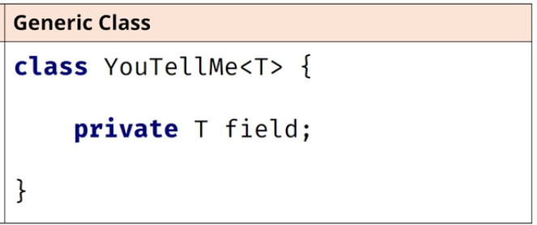

Generic class declaration has angle brackets with a T in them directly after the class name.

T is the placeholder for a type that will be specified later.

This is called a type identifier, and it can be any letter or word, but T which is short for Type is commonly used.



The field's type is that placeholder, just T, and this means it can be any type at all.

An example is a declaration of the generic ArrayList. The reference type is ArrayList, the type parameter (or parameterized type) is String, which is declared in angle brackets, and listOfString is the variable name.


### Generic classes can be bounded, limiting the types that can use it.

Example:
```aidl
public class Team<T extends Player> {}
```
This is saying the parameterized type T, has to be a Player, or a **subtype** of Player.

This declaration establishes what is called an **upper bound**, on the types that are allowed to be used with this class.