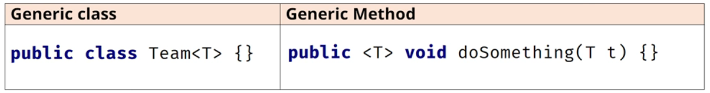
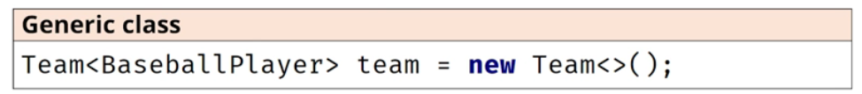
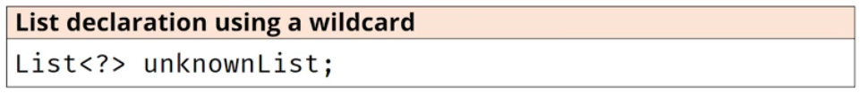
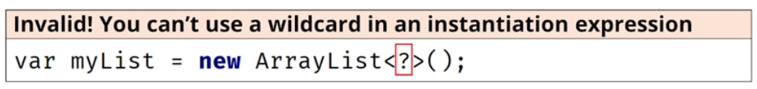
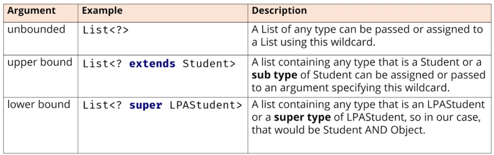

### Type Parameters, Type Arguments and using a Wildcard

A **type parameter** is a generic class, or generic method's declaration of the type.

T is the type parameter in the below generic class and method.

A **type argument** declares the type to be used, and is specified in a type reference, such as a local variable reference, method parameter declaration, or field declaration.

A **wildcard** can only be used in a **type argument**, not in the type parameter declaration.

A wildcard means the type is unknown.

A wild card can't be used in an instantiation of a generic class.

A wildcard can be **unbounded**, or alternately, specify either an **upper bound** or **lower bound**.

You can't specify both an upper bound and a lower bound, in the same declaration.

