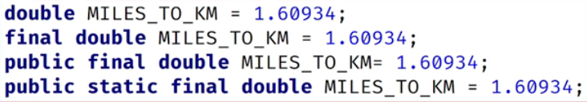

An **inteface** is similar to an abstract class, although it **isn't a class** at all.

It's a **special** type, that's more like a **contract** between the class and client code, that the compiler enforces.

By declaring it's using an interface, your  class must implement all the abstract emthods, on the interface.

A class agrees to this, because it wants to be **known by that type**, by the outside world, or the client code.

An **interface** lets **classes that might have little else in common**, be recognized as a special reference type.

Declaring an interface is similar to declaring a class, using the keyword **interface**, where you would use **class**.

Example:
```aidl
public interface FlightEnabled {}
```
An interface is usually named, according to the set of behaviors it describes.

Many interfaces ends in "able", like Comparable, and Iterable, again meaning something is capable, or can do, a given set of behaviors.

A class is associated to an interface, by using the **implements** clause in the class declaration.

Example:
```aidl
public class Bird implements FlightEnabled {}
```

Because of this declaration, we can use FlightEnabled as the reference type, and assign it an instance of bird.

In this code sample, we create a new Bird object, but we assign it to the FlightEnabled variable named flier.
```aidl
FlightEnabled flier = new Bird();
```

#### A class can use extends and implements in the same declaration.

A class can only **extend** a **single class**, which is why Java is called single inheritance.

But a class can **implement many interfaces**. This gives us **plug and play functionality**, which is what makes them so powerful.
```aidl
public class Bird extends Animal implements FlightEnabled, Trackable {}
```
### The "final" modifier

When we use the final modifier, we prevent any further modifications to that component.
* a final method means it can't be overridden by a subclass
* a final field means an object's field can't be reassigned or given a different value, after its initialization
* a final static field is a class field that can't be reassigned, or given a different value, after the class's initialization process
* a final class can't be overridden, meaning no class can use it, in the extends clause
* a final variable, in a block of code, means that once it's assigned a value, any remaining code in the block can't change it
* a final method parameter means, we can't assign a different value to that parameter in the method code block

### Constants in Java
A constant in Java is a variable that can't be changed.

A constant variable is a final variable of primitive type, or type String, that is initialized with a constant expression.

Constants in Java, are usually named with all uppercase letters, and with underscores between words.

A static constant means we access it via the type name.

We saw this with the INTEGER.MAX_VALUE, and the INTEGER.MIN_VALUE fields.

### A field declared on an Interface is always public, static and final

Java let's us specify these like an ordinary field on an interface.


### Coding to an Interface

Coding to an interface scales well, to support new subtypes, and it helps when refactoring code.

The downside though, is that alterations to the interface may wreak havoc, on the client code.

Imagine that you have 50 classes using your interface, and you want to add an extrac abstract method, to support new functionality.

As soon as you add a new abstract method, all 50 classes won't compile.

Your code isn't backwards compatible, with this kind of change to an interface.

Interfaces haven't been easily extensible in the past.

But Java has made several changes to the Interface ype over time to try to address this last problem.

