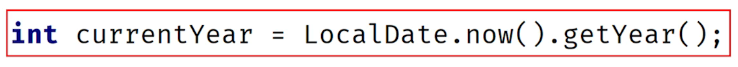

### Local and Anonymous Class Challenge

First, you need to create record named Employee that contains First Name, Last Name and Hire date.

Set up a list of Employees with various names and hire dates in the main method.

Set up a new method that takes this list of Employees as a parameter.

Create a local class to wrap this class, (pass Employee to the constructor and include a field for this) and add some calculated fields, such as full name, and years worked.

Create a list of employees using your local class.

Create an anonymous class to sort your local class employees, by full name, or years worked.

Print the sorted list.

Hint: Here is another review of a date function, which should help you with calculating years worked.

