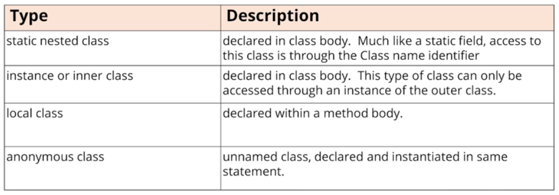

### Nesting classes (or types) within another class (or type)

A class can contain other types within the class body, such as other classes, interfaces, enums, and records. These are called nested types or nested classes.

#### Four different types of nested class

