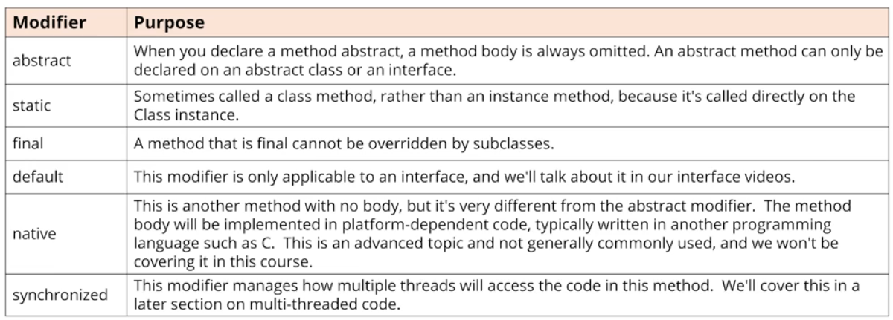

### Method Modifiers

In addition to access modifiers, methods have other modifiers, which we'll list here, as a high-level introduction.



The abstract class is declared with the **abstract** modifier.

Example:
```aidl
abstract class Animal {} // An abstract class is declared with the ***abstract*** modifier.
```

An **abstract** class is a class that's **incomplete**.

You can't create an instance of an abstract class.

Example:
```aidl
Animal a = new Animal(); // INVALID, an abstract class never gets instantiated
```
An abstract class can still have a constructor, which will be called by its subclasses, during their construction.

An abstract class's purpose is to define the behavior it's subclasses are required to have, so it always participates in **inheritance**.

Example:
```aidl
class Dog extends Animal {} // Animal is abstract, Dog is not
```

A class that extends an abstract class, can also be abstract itself.

Example:
```aidl
abstract class Mammal extends Animal {} // Animal is abstract, Mammal is also abstract
```

An abstract class can extend a concrete class

Example:
```aidl
abstract class BestOfBreed extends Dog {}
```

An abstract method is declared with the modifier **abstract**.

Example:
```aidl
abstract class Animal {
    public abstract void move();
}
```
An abstract method tells the outside world, that all Animals will move. 
Any code that uses a subtype of Animal, knows it can call the move method, and the subtype will implement this method with this signature.

An abstract class that extends another abstract class has some flexibility.
* It can implement all of the parent's abstract methods.
* It can implement some of them.
* Or it can implement none of them.
* It can also include additional abstract methods, which will force subclasses to implement both its parent's abstract methods, as well as it's own.