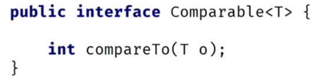
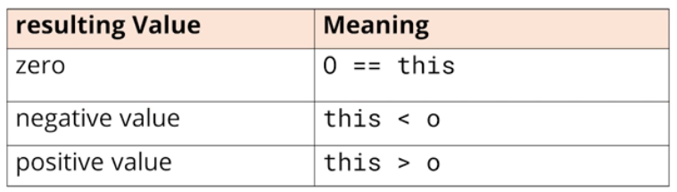
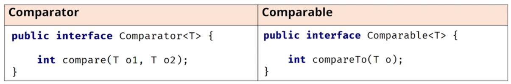
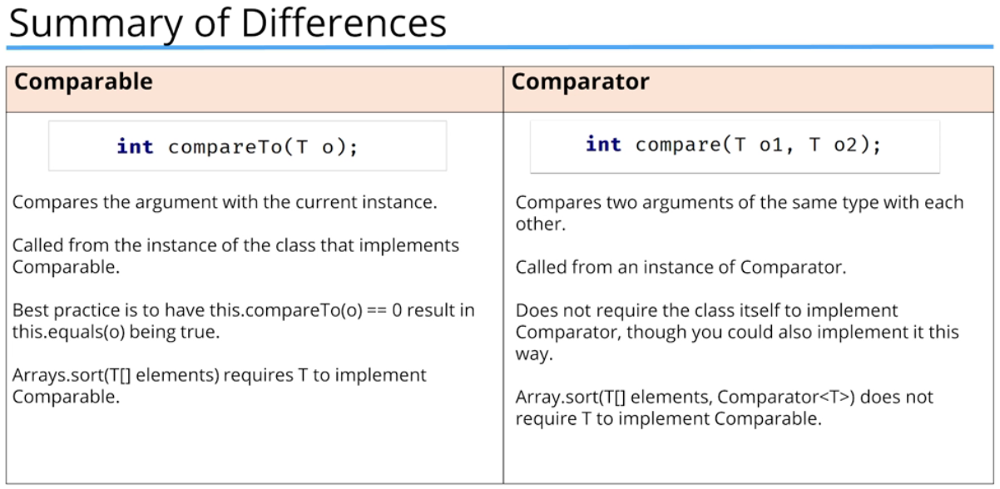

### Interfaces used for sorting

**Comparable interface** - String or primitive wrapper classes like Integer or Character are sortable because they implement **Comparable** interface.

**Comparable interface declaration**

It's a generic type, meaning it's parameterized.

The method takes one object as an argument and compares it to the current instance.

The table below shows what the results of the **compareTo** method should mean when implemented.

**Comparator interface**

