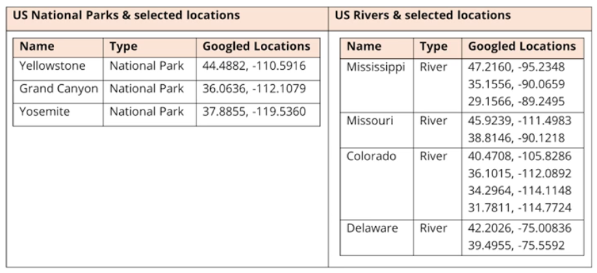
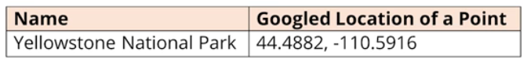
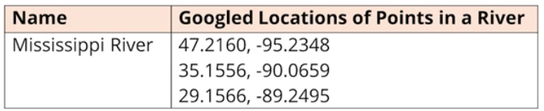

### Generic Class Challenge

Start with a **Mappable Interface** that has one abstract method, render.

You'll create two classes **Point** and **Line**, that implement this interface.

You'll create **two specific classes** that extend each of these, for a mappable item of interest.

The Parks will points and the rivers will be lines

You should have constructors or methods, to support adding a couple of attributes, and some location data, to your two specific classes.

You can pass the location data of a point type, as a String, or a set of double values, representing latitude and longitude.

You can pass the multiple locations of a line as a set of strings or a two-dimensional array of doubles that represents the multiple point on your line.

