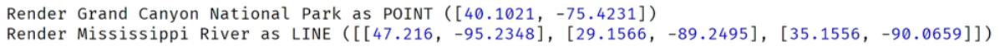
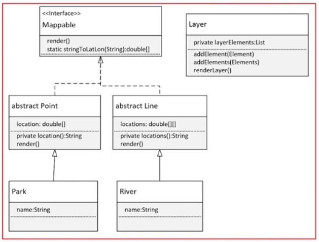

### Generic Class Challenge

Start with a **Mappable Interface** that has one abstract method, render.

You'll create two classes **Point** and **Line**, that implement this interface.

You'll create **two specific classes** that extend each of these, for a mappable item of interest.

The Parks will be points and the rivers will be lines

You should have constructors or methods, to support adding a couple of attributes, and some location data, to your two specific classes.

You can pass the location data of a point type, as a String, or a set of double values, representing latitude and longitude.

You can pass the multiple locations of a line as a set of strings or a two-dimensional array of doubles that represents the multiple point on your line.

In addition to these classes, you'll create a **generic class** called **Layer**.

Your Layer class should have **one type parameter**, and should only **allow Mappable elements** as that type.

This generic class should have a **single private field**, a **list of elements** to be mapped.

This class should have a method or constructor or both to add elements.

You should create a method, called renderLayer, that loops through all elements, and executes the method render, on each element.

Your main method should create some instances of your specific classes, which include some location data.

These should get added to a typed Layer, and the render Layer method called on that.

Sample output is shown here:

This diagram shows how build this.

