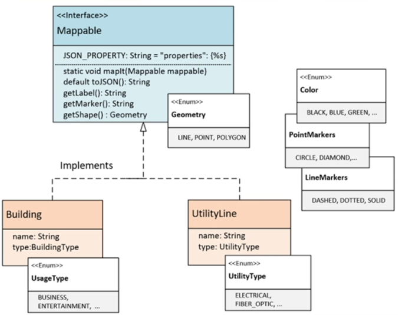
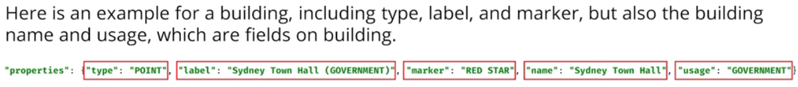
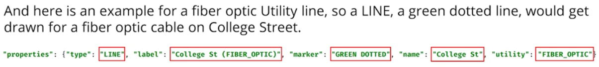

Create a **Mappable** interface.

The interface should **force classes to implement three methods.**
* One method should return a **label** (how the item will be described on the map).
* One should return a **geometry type** (POINT or LINE) which is what the type will look like on the map.
* The last should return an **icon type** (sometimes called a map marker).

In addition to the three methods described, the interface should also include:
* A constant String value called JSON_PROPERTY, which is equal to: "properties":{%s}. A hint here, using a text block will help maintain quotation marks in your output.
* Include a default method called toJSON() that prints out the type, label, and marker. I'll show examples shortly.
* A **static method**, that takes a Mappable instance as an argument. This method should print out the properties for each mappable type, including those mentioned above, but also any other fields on the business classes.

You'll also want to create two classes that implement this interface, a **Building** and **UtilityLine**.
* One class, in my case the Building, should have a geometry type of POINT, and One class should have a geometry type of Line. The UtilityLine class will be my example for a class that will be a LINE on a map.
* The Building will be shown on a city map, as a point with the icon and label specified, and the Utility Line will be a line on the map.

The final output should output the geometry type, the icon information, and the label.

